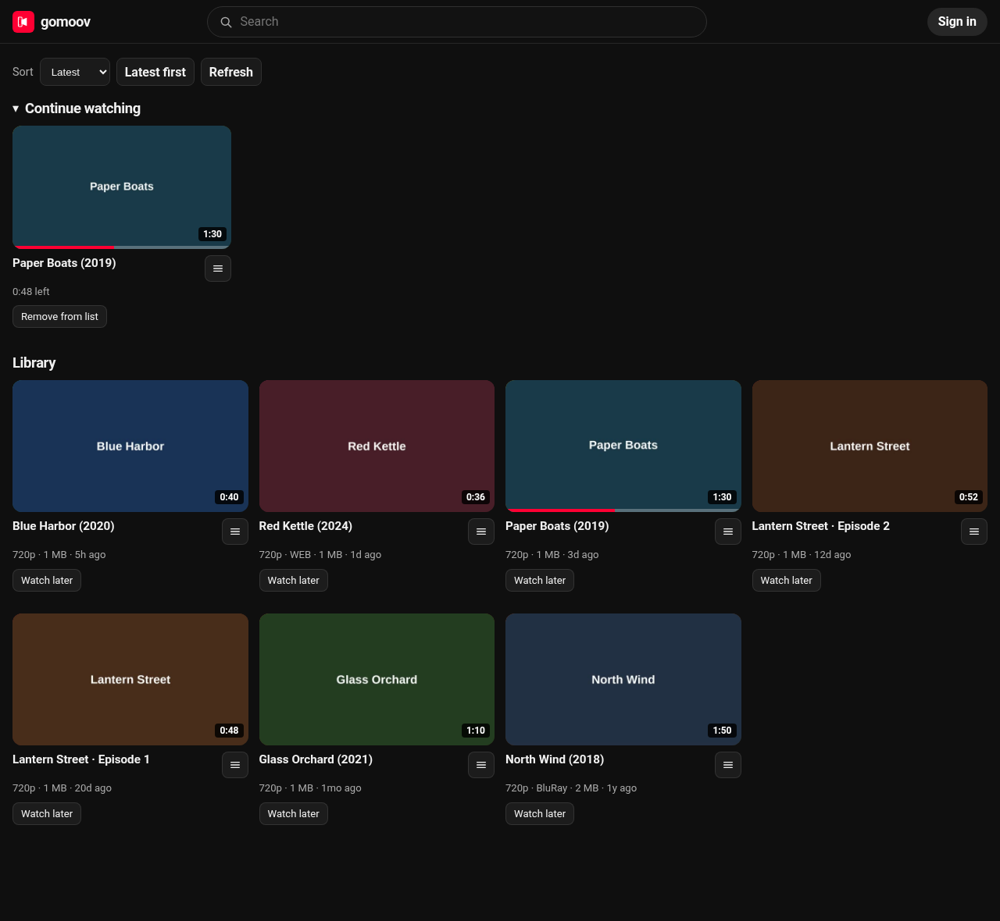
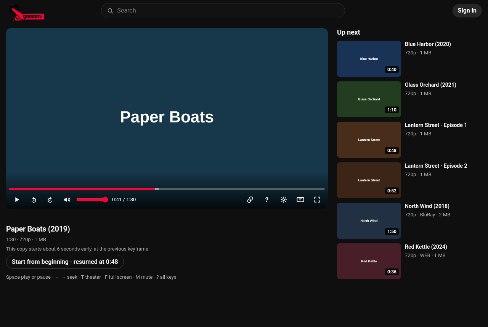
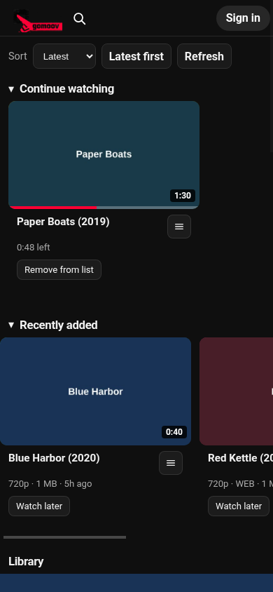
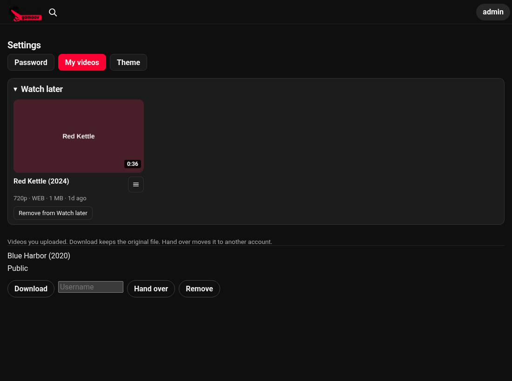

# gomoov


gomoov is a local web player for the video files in a folder. A normal launch is that player. Accounts, uploads, and private videos are there when you start it with `--user-mode`.

The page, script, and stylesheet are built into the `gomoov` binary. Playback uses `ffmpeg` and `ffprobe`. A normal build uses the ones on `PATH`. `make with-ffmpeg` downloads a static GPL build and packs both programs into the binary so the machine does not need them installed.

## Requirements

- Go 1.22 or newer, to build
- `ffmpeg` and `ffprobe` on `PATH`, unless you build with `make with-ffmpeg`
- A browser on the machine that will watch

## Optional bundled ffmpeg

`make with-ffmpeg` downloads a static Linux x86_64 GPL build from [BtbN/FFmpeg-Builds](https://github.com/BtbN/FFmpeg-Builds/releases/latest) (this includes libx264), then compiles gomoov with those binaries inside it. On startup they are unpacked to `~/.gomoov/bin`. The resulting program is much larger, and the GPL applies to that build because of libx264.

```bash
make with-ffmpeg
make install-with-ffmpeg
```

`FFMPEG_URL` selects another archive if you need a different architecture, for example the arm64 asset from the same release. The archive must contain `bin/ffmpeg` and `bin/ffprobe`. A plain `make` does not download anything and keeps using the system tools.

## Build and install

```bash
make
make install
```

`make install` copies the binary to `~/.local/bin/gomoov`. `PREFIX` and `BINDIR` change that location:

```bash
make install PREFIX=/usr/local
```

## Run

Start it in the folder that holds the movies. It listens on `0.0.0.0:8080` unless `HOST` or `PORT` is set.

```bash
cd ~/videos
gomoov
```

`-L` / `--library` picks that folder without changing the working directory. The systemd unit always passes it, so the service does not depend on wherever `make` happened to run.

That is the simple player. The library in this folder is listed, and so are public uploads under `~/gomoov`. Sign-in, the user list, and private uploads are hidden. Anyone who can open the address can play the public videos.

```bash
gomoov -U
gomoov --user-mode
```

User mode is the account server. The first run creates `admin` / `admin` and asks for a new password before anything else. An existing install whose admin password is still `admin` is asked the same thing. An admin can add users, set a password, force a change at the next sign-in, allow or refuse uploads, open someone’s videos, and ban or delete an account. Ban and delete ask for confirmation. A banned person is signed out and cannot sign in. Deleting an account also deletes the videos in that person’s `~/gomoov/<id>/` folder. The admin account cannot be banned or deleted. Removing a video appends a line to `~/.gomoov/audit.log` with who deleted it, when, and the path.

Private uploads are visible to their owner and to the admin. Other people, and anyone who is not signed in, see public videos only. In the simple player, private uploads stay hidden even for the owner. Add `--show-private` to include them for that launch:

```bash
gomoov --show-private
```

`--show-private` does nothing in user mode. `-p` is the listen port, not this switch.

## Flags

| Flag | Meaning |
| --- | --- |
| `-h`, `--help` | Show help and exit |
| `-H`, `--host ADDR` | Listen address. Overrides `HOST`. Default `0.0.0.0` |
| `-p`, `--port PORT` | Listen port. Overrides `PORT`. Default `8080` |
| `-V`, `--version` | Print the version and exit |
| `-U`, `--user-mode` | Accounts, uploads, and the usual private-video rules |
| `--show-private` | In the simple player, also show private uploads |
| `-m`, `--movie PATH` | Open this video in a browser |
| `-L`, `--library DIR` | Movie folder. Default: the current directory |
| `-i`, `--include DIR` | Only scan these directories |
| `-e`, `--exclude DIR` | Skip these directories |

`-i` and `-e` can be repeated, or take a comma-separated list. Paths may be absolute, relative to the launch folder, or start with `~/`. An include may be outside the launch folder. An include inside an exclude is an error.

```bash
gomoov -L ~/videos
gomoov -i ~/videos,/other/films
gomoov --exclude ~/videos/extras,~/videos/samples
gomoov -e ~/videos/extras -e ~/videos/samples
gomoov -m ~/videos/episode.mkv
```

`~/gomoov` stays available either way: public uploads are listed, and private ones follow the rules above.

## While you watch

The home page opens sorted by latest. It can also sort by name, longest, size, or path, and can group a path sort into collapsible folders. Refresh checks the folder for new files and probes a file again only when its size or modification time changed. Continue watching is shared across every folder where gomoov is launched, and a movie is listed only when that file is in the current library. Resume is stored by absolute path in `~/.gomoov/progress.json`.

**Watch later** is a separate list in this browser, under Settings → My videos. It does not start playback. **Recently added** shows files that arrived since the last visit.

A copied H.264 stream starts at the previous keyframe. The player says when that is earlier than the time you asked for. Changing quality keeps the current picture up until the new stream has a frame. If several videos need encoding at once, extra ones wait and the player says so. VAAPI or NVENC is used for that encode when the machine has it; burned-in subtitles and a smaller picture stay on libx264.

In the player, `?` opens the keyboard list. Space or K plays, J and L or the arrow keys seek, M mutes, F is full screen, T is theater, and 0–9 jumps through the file. The link button copies `#/watch?v=...&t=120` for the current moment.

The header and the browser tab say **gomoov**.

In user mode, **My videos** limits the home page to uploads from the signed-in account. **Settings** has three tabs:

- **Password** changes the account password.
- **My videos** lists that account’s uploads. From there you can download the original file, hand it to another account, or remove it.
- **Theme** picks a personal theme, or **Site default**.

Themes are Dark (the default), White, Cyber green, Fancy, Neon, Cyberpunk, Retro, Ocean, and Sunset. Cyber green follows gonitor: a very dark background, yellow headings, green links, and a dark-green bar on the active menu item. A personal theme is stored on the account and wins over the site theme. **Site default** follows the theme saved in Admin.

## Admin

Sign in as an admin and open **Admin**.

- **Users** adds accounts and opens one to set a password, allow uploads, ban, or delete. Ban and delete ask for confirmation.
- **Videos** lists every title, with the owner’s username. A file from the launch folder is marked Library.
- **Access** turns on HTTP basic auth and an IP allow list or exclude list.
- **Theme** sets the site default.

Basic auth asks the browser for a username and password before any page or video. It is separate from account sign-in. Leave the password blank when you save other access settings and the current basic-auth password stays.

The IP rule is off, allow only the listed addresses, or exclude the listed addresses. A line can be one IP or a CIDR range such as `192.168.1.0/24`. `127.0.0.1` is always allowed. A save that would block the request you are making is refused.

The site theme chosen here is the default for people who have not picked their own.

## Where files go

| Path | What it is |
| --- | --- |
| Launch folder | Movies gomoov scans, minus anything excluded |
| `~/gomoov/<user-id>/` | Videos that account uploaded |
| `~/.gomoov/users.json` | Accounts and password hashes |
| `~/.gomoov/sessions.json` | Sign-in sessions |
| `~/.gomoov/visibility.json` | Which uploads are private |
| `~/.gomoov/progress.json` | Continue watching |
| `~/.gomoov/settings.json` | Site theme, basic auth, and IP rules |
| `~/.gomoov/audit.log` | Who deleted a video, and when |
| `~/.gomoov/cache` | Probe, thumbnail, and subtitle cache. Override with `MOOVIES_CACHE` |

## Docker

The image listens on port 8080, reads movies from `/videos`, and keeps accounts, uploads, and the cache under `/var/lib/gomoov`. It uses Debian's `ffmpeg`. User mode is on unless `USER_MODE=0`.

```bash
mkdir -p ~/videos
LIBRARY_DIR=~/videos docker compose up --build -d
```

`LIBRARY_DIR` is the movie folder on the host. It is mounted at `/videos`. `PORT` changes the published port. Build args `UID` and `GID` (both default to 1000) are the user inside the container, so that user must be able to read the movie folder.

```bash
UID="$(id -u)" GID="$(id -g)" LIBRARY_DIR=~/videos docker compose up --build -d
```

Accounts and uploaded videos stay in the `gomoov-home` volume (`~/gomoov` and `~/.gomoov` inside the container). Open `http://127.0.0.1:8080`.

A machine with VAAPI can pass the render device through. Add this under the `gomoov` service:

```yaml
devices:
  - /dev/dri:/dev/dri
```

## systemd

Both targets install the binary and a service that runs `gomoov -U -L <library> -H <host> -p <port>`. `LIBRARY` is that folder and defaults to the directory you run `make` from. `HOST` defaults to `0.0.0.0` and `PORT` to `8080`. `SHOW_PRIVATE=1` adds `--show-private`.

Your own user service:

```bash
cd ~/videos
make install-user-service
make install-user-service HOST=127.0.0.1 PORT=8090 LIBRARY=$HOME/videos
```

The unit is `~/.config/systemd/user/gomoov.service`. It starts now and again at login. To keep it running when you are logged out:

```bash
loginctl enable-linger "$USER"
systemctl --user status gomoov
```

A system service, installed as root:

```bash
cd /home/you/videos
sudo make install-service LIBRARY=/home/you/videos
```

The unit is `/etc/systemd/system/gomoov.service`. `make install-service` refuses to run unless you are root. If you used `sudo`, the process runs as `SUDO_USER` so `~/gomoov` and `~/.gomoov` belong to that person. A root shell with no `SUDO_USER` runs the service as root.

```bash
sudo systemctl status gomoov
```

Stop a gomoov you started by hand before enabling either service. Both want port 8080. `SERVICE=gomoov` changes the unit name.

## Development

```bash
go test ./...
```

A tag named `v1.*` builds the Linux binaries and attaches them to that GitHub release. `gomoov-linux-amd64` and `gomoov-linux-arm64` use `ffmpeg` and `ffprobe` on `PATH`. `gomoov-linux-amd64-ffmpeg` includes both.

The version in `main.go` increases on each change. Movies, torrents, and the built `gomoov` binary are not part of the git history.

## Screenshots

These are the real player, opened on a folder of short generated clips.



The home page sorts by latest and keeps Continue watching and Recently added above the library.



Playback keeps the controls on the picture, with Up next beside it.



The phone layout uses the same shelves in a single column.



Watch later lives in Settings, on My videos, next to uploads. From there you can download a file or hand it to another account.
